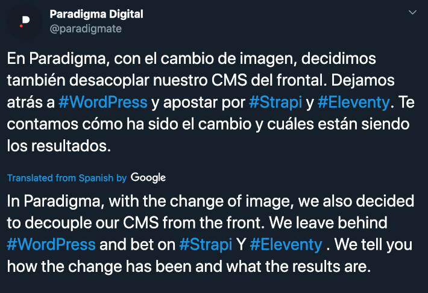
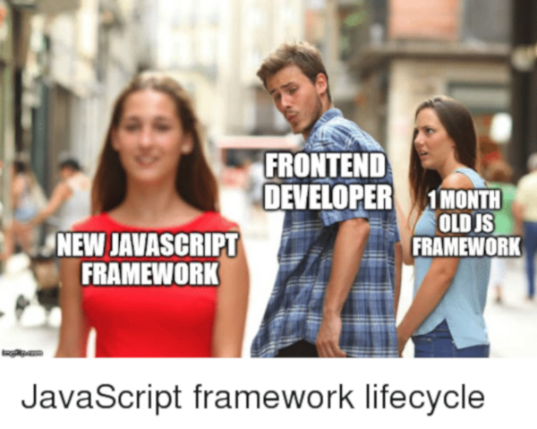
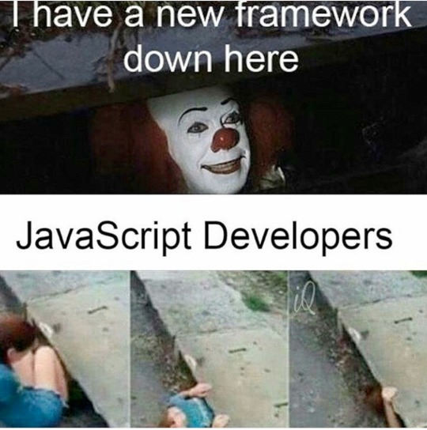
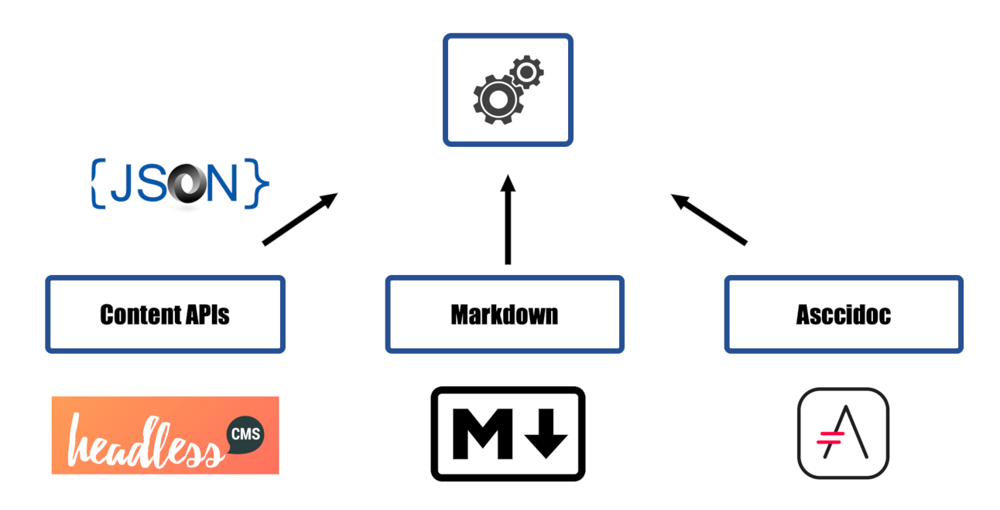
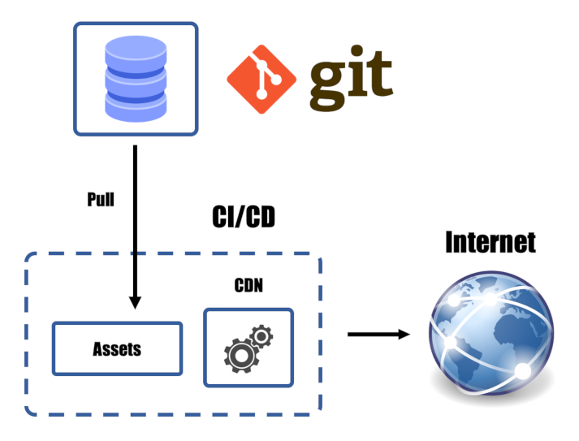
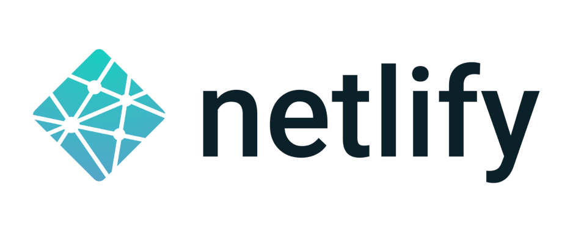

# #JAMStack

### @aruizca - aruizca.com
<small>Sponsored by</small> 

 
 
<small> at @codernatus_es 01/02/2020 </small>

Notes:
* Thanks
* About Comalatech
* Pledge 1%
* what is the preso about:
  * message 1: overview
  * message 2: practicallity of what we are going to see
  * message 2: money wasted on hosting
* No need for taking notes or photos
* Ask question about pronuntiation

---

----

---

### JAMstack Core Technologies

---

### Dynamic Vs Static websites

 
<!-- .element: class="fragment" data-fragment-index="1"  -->

----

### Static can be GOOD!!

- It means it can be served straight from a CDN
- It means best load times and scalability
<!-- .element: class="fragment" data-fragment-index="1"  -->
- It means reduced complexity
<!-- .element: class="fragment" data-fragment-index="2"  -->
- It means simple, reliable and reproducible deployments
<!-- .element: class="fragment" data-fragment-index="3 "  -->
- And way CHEAPER!!!
<!-- .element: class="fragment" data-fragment-index="5  "  -->

Notes:
* Mention FTP releases

---
# A bit about STACKS?

Notes:
* let's see how architecutures and stacks have evolved over time
* they are all still relevant as of today
----

### LAMP Stack

 

Notes:
* Ask how many have tried this stack
* Talk about server side rendering, AJAX, web 2.0, ...
* Talk about experience and PHP

----
### MEAN Stack

Notes:
* Ask how many know about SPIs. EG: GMail, Google Maps
* Talk about Angular and client side rendering

----
### JAM Stack #1

* Pre-rendered
* Statically Served
* Progressively Enhanced

<!-- .element: class="fragment" data-fragment-index="1"  -->

Notes:
* What does prerendered mean? 
* Talk about progressive enhancement
* This presentation follows this architecture
* Use cases
* Free $$

----
### JAM Stack #2

* Client side rendering
* Headless services
* Progressive apps

<!-- .element: class="fragment" data-fragment-index="1"  -->

Notes:
* What does client side rendering mean? 
* More complex
* Talk about pprogressive apps
* Use cases: eCommerce
* Not free but cheap

---

### JAMStack is just a NEW APROACH!!
It is a new "philosophy" which defines a high level architecture for static web development:
* Non-prescriptive
<!-- .element: class="fragment" data-fragment-index="1"  -->
* High performant
<!-- .element: class="fragment" data-fragment-index="2"  -->
* Cheap and easy to scale
<!-- .element: class="fragment" data-fragment-index="3"  -->
* Secure
<!-- .element: class="fragment" data-fragment-index="4"  -->
* Developer friendly
<!-- .element: class="fragment" data-fragment-index="5"  -->

----

### Gaining Traction quickly

---

### JAMStack Core Technologies

---

### JavaScript === ECMAScript

|Edition|Date published|Name|
|--- |--- |--- |
|ES6|June 2015|ECMAScript 2015 (ES2015)|
|ES7|June 2016|ECMAScript 2016 (ES2016)|
|ES8|June 2017|ECMAScript 2017 (ES2017)|
|ES9|June 2018|ECMAScript 2018 (ES2018)|
|ES10|June 2019|ECMAScript 2019 (ES2019)|

Notes:
* ECMA = European Computer Manufatures Association for standards
* ES5 is from 2009
* javascripts versions < ES6  are not equal
* incremental minor updates after ES6
* standards are not adopted straight away by browsers

----

### ES6 main relevant features

* Modules
<!-- .element: class="fragment" data-fragment-index="1" -->
* Classes
<!-- .element: class="fragment" data-fragment-index="2" -->
* Promises
<!-- .element: class="fragment" data-fragment-index="3" -->
* Block-Scoped Constructs "let" and "const"
<!-- .element: class="fragment" data-fragment-index="4" -->
* Arrow Functions
<!-- .element: class="fragment" data-fragment-index="4" -->
* Destructuring
<!-- .element: class="fragment" data-fragment-index="5 " -->
* Default parameters
<!-- .element: class="fragment" data-fragment-index="5 " -->  
* String interpolation and multi-line literals.
<!-- .element: class="fragment" data-fragment-index="5 " -->
* ...
<!-- .element: class="fragment" data-fragment-index="6 " -->

----

### JS Tools and Libraries - ECOSYSTEM

<!-- .element: class="fragment" data-fragment-index="1" -->

npm 👉 biggest library repository in the world with ~500K packages
<!-- .element: class="fragment" data-fragment-index="2" --> 

----

----

----

----

---
### APIs 
* Microservices
<!-- .element: class="fragment" data-fragment-index="1" -->

<!-- .element: class="fragment" data-fragment-index="2" -->

Notes:
* Dog shit analogy

----
### APIs
* REST / {json:api} / GraphQL
<!-- .element: class="fragment" data-fragment-index="1" -->
* API Economy
<!-- .element: class="fragment" data-fragment-index="2" -->
   

<!-- .element: class="fragment" data-fragment-index="3" -->

Notes:
* Representational State Transfer

----
### Services

* Content APIs => Headless CMS
<!-- .element: class="fragment" data-fragment-index="1" -->
* Digital Assests
<!-- .element: class="fragment" data-fragment-index="2" -->
* Authentication
<!-- .element: class="fragment" data-fragment-index="3" -->
* Files
<!-- .element: class="fragment" data-fragment-index="4" -->
* eCommerce
<!-- .element: class="fragment" data-fragment-index="5" -->
* Banking
<!-- .element: class="fragment" data-fragment-index="6" -->
* ...
<!-- .element: class="fragment" data-fragment-index="7" -->

---
### Markup

----
### Template Engines

#### www.staticgen.com

----
### Data Sources

---
# Other Essential technologies

---
### Git based deployments

---
### Continuous Integration

----
### Demo Time

---
### Cloud runtime platforms

#### Shift the Burden
<!-- .element: class="fragment" data-fragment-index="1" -->
* Hardware maintenance overhead
<!-- .element: class="fragment" data-fragment-index="2" -->
* Software management overhead
<!-- .element: class="fragment" data-fragment-index="3" -->
* Networking and Security
<!-- .element: class="fragment" data-fragment-index="4" -->
* Horizontal and vertical scaling
<!-- .element: class="fragment" data-fragment-index="5" -->

----
### Serverless computing

| |Azure Functions|AWS Lambdas|GCP Cloud Functions|
|--- |--- |--- |--- |
|Runtimes Available|Node.js Java .NET (C#,F#) Python|Node Java .NET (C#) Python Go Ruby|Node.js Python Go|
|Execution Timeout|5 min / 10 min|5min / 15min|1min / 9min|

---
# Other Examples

Notes:
* Ajaxanywhere with JBake + Asciidoctir
* Oskar resume
* Documentation
* Book authoring 
* Gastby

---
### Questions?

---
# Thank you!!!

Presentation can be found at:
#### https://github.com/aruizca/jamstack-codernauts-presentation