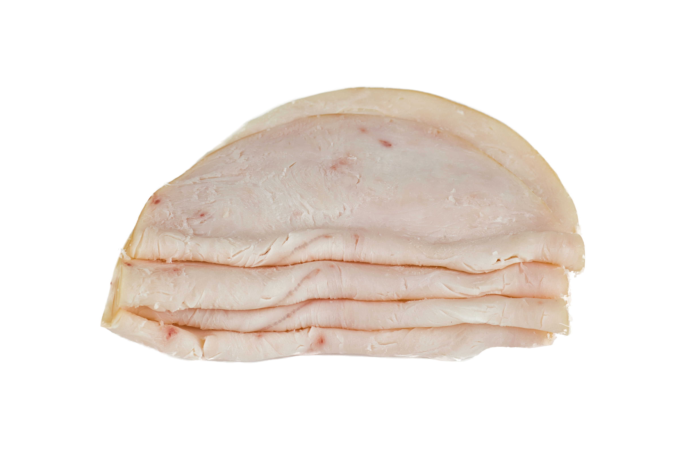
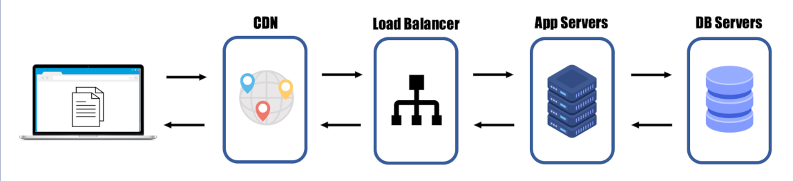

# #JAMstack

### @aruizca
<small>Sponsored by</small> 

 
 
<small> at @codernatus 01/02/2020 </small>

---

----

---
### JAMstack Core Technologies

---
### Dynamic Vs Static websites

 
<!-- .element: class="fragment" data-fragment-index="1"  -->

----
### Static is GOOD!!

- It means it can be served straight from a CDN
- It means best load times and scalability
<!-- .element: class="fragment" data-fragment-index="1"  -->
- It means reduced complexity
<!-- .element: class="fragment" data-fragment-index="2"  -->
- It means simple, reliable and reproducible deployments
<!-- .element: class="fragment" data-fragment-index="3 "  -->

---
### JavaScript === ECMAScript

|Edition|Date published|Name|
|--- |--- |--- |
|ES6|June 2015|ECMAScript 2015 (ES2015)|
|ES7|June 2016|ECMAScript 2016 (ES2016)|
|ES8|June 2017|ECMAScript 2017 (ES2017)|
|ES9|June 2018|ECMAScript 2018 (ES2018)|
|ES10|June 2019|ECMAScript 2019 (ES2019)|

----
### ES6 main relevant features

fragment example 1
<!-- .element: class="fragment" data-fragment-index="1" -->

fragment example 2
<!-- .element: class="fragment" data-fragment-index="2" -->
----
### Frontend Libraries

---
### APIs

---
### Markup