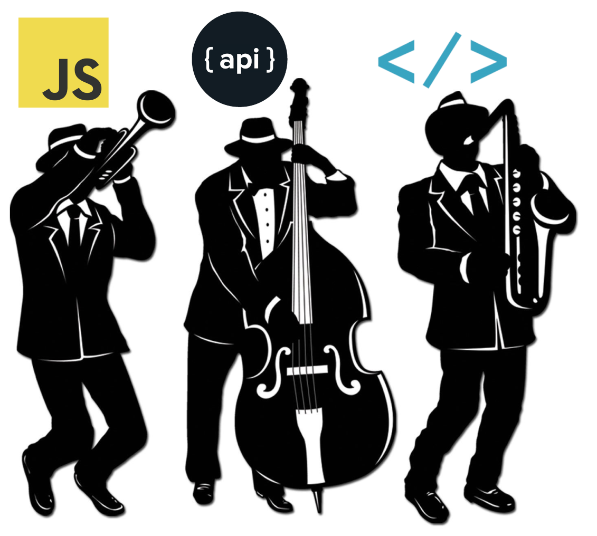

# #JAMstack

### @aruizca - aruizca.com
<small>Sponsored by</small> 

 
 
<small> at @codernatus 01/02/2020 </small>

---

----

---
### JAMstack Core Technologies

---
### Dynamic Vs Static websites

 
<!-- .element: class="fragment" data-fragment-index="1"  -->

----
### Static can be GOOD!!

- It means it can be served straight from a CDN
- It means best load times and scalability
<!-- .element: class="fragment" data-fragment-index="1"  -->
- It means reduced complexity
<!-- .element: class="fragment" data-fragment-index="2"  -->
- It means simple, reliable and reproducible deployments
<!-- .element: class="fragment" data-fragment-index="3 "  -->

---
# A bit about STACKS?

----
### LAMP Stack

 

----
### MEAN Stack

----
### JAM Stack #1

* Pre-rendered
* Statically Served
* Progressively Enhanced

<!-- .element: class="fragment" data-fragment-index="1"  -->

----
### JAM Stack #2

* Client rendered
* Headless services
* Progressive apps

<!-- .element: class="fragment" data-fragment-index="1"  -->

---
### JAMStack is just a NEW APROACH!!
It is a new "philosophy" which defines a high level architecture for static web development:
* Non-prescriptive
<!-- .element: class="fragment" data-fragment-index="1"  -->
* High performant
<!-- .element: class="fragment" data-fragment-index="2"  -->
* Cheap and easy to scale
<!-- .element: class="fragment" data-fragment-index="3"  -->
* Secure
<!-- .element: class="fragment" data-fragment-index="4"  -->
* Developer friendly
<!-- .element: class="fragment" data-fragment-index="5"  -->

---
### JAMStack Core Technologies

---
### JavaScript === ECMAScript

|Edition|Date published|Name|
|--- |--- |--- |
|ES6|June 2015|ECMAScript 2015 (ES2015)|
|ES7|June 2016|ECMAScript 2016 (ES2016)|
|ES8|June 2017|ECMAScript 2017 (ES2017)|
|ES9|June 2018|ECMAScript 2018 (ES2018)|
|ES10|June 2019|ECMAScript 2019 (ES2019)|

----
### ES6 main relevant features

* Modules
<!-- .element: class="fragment" data-fragment-index="1" -->
* Classes
<!-- .element: class="fragment" data-fragment-index="2" -->
* Promises
<!-- .element: class="fragment" data-fragment-index="3" -->
* Block-Scoped Constructs Let and Const
<!-- .element: class="fragment" data-fragment-index="4" -->
* Arrow Functions
<!-- .element: class="fragment" data-fragment-index="4" -->
* Destructuring
<!-- .element: class="fragment" data-fragment-index="5 " -->
* Default parameters
<!-- .element: class="fragment" data-fragment-index="5 " -->  
* String interpolation and multi-line literals.
<!-- .element: class="fragment" data-fragment-index="5 " -->

----
### JS Tools and Libraries

 
 <!-- .element: class="fragment" data-fragment-index="1" -->

   npm 👉 biggest library repository in the world with ~500K packages
<!-- .element: class="fragment" data-fragment-index="2" --> 

---
### APIs

---
### Markup 